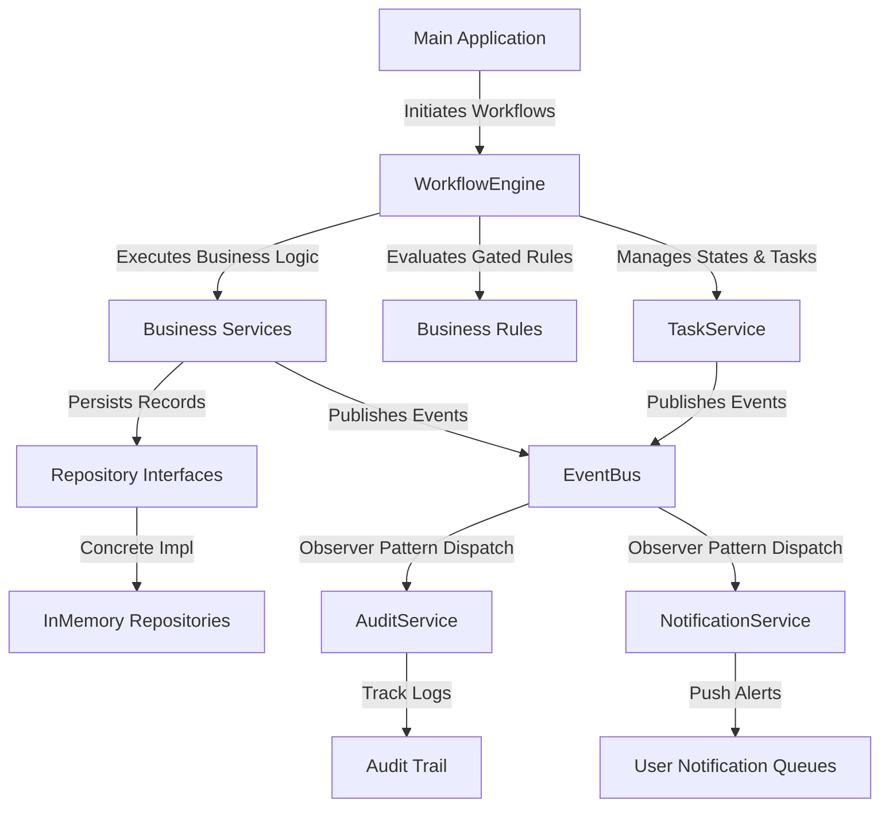
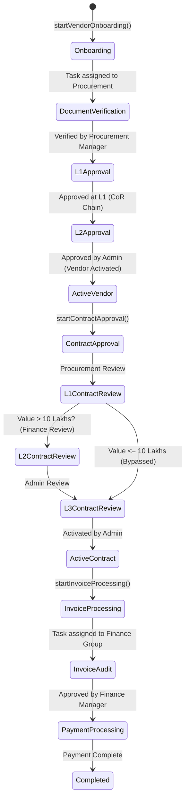

# Vendor Lifecycle Management System (VLMS)
### Enterprise Java LLD & Appian BPM Workflow Simulator

Welcome to the **Vendor Lifecycle Management System (VLMS)**. This project is a professional-grade, pure Java 17, console-based, and in-memory Low-Level Design (LLD) project designed to showcase senior-level object-oriented design, SOLID principles, design patterns, and business process workflow orchestration.

Specifically, it implements a **custom workflow/BPM engine** that mimics the key concepts, execution patterns, and architectural abstractions of **Appian Business Process Management (BPM)** platforms.

---

## 🗺️ Appian BPM to Java LLD Mapping

| Appian Concept | Java LLD Component | Description |
| :--- | :--- | :--- |
| **Process Model** | `WorkflowDefinition` | Defines the sequence of steps, gates, and metadata for a business process. |
| **Process Instance** | `WorkflowInstance` | Represents a running process flow executing steps with unique ID (`WKF-xxxx`). |
| **Process Context (pv!)** | `WorkflowContext` | Memory buffer holding process variables (e.g., current Vendor, Contract, Invoice). |
| **User Input Task (UIT)** | `Task` / `TaskService` | A human task requiring manual intervention, claim, completion, and validation. |
| **Task Queues / Groups** | `UserRole` & Groups | Roles like `Procurement Group`, `Finance Group`, `Admin Group` that govern task claiming. |
| **Gateways (XOR/OR)** | `WorkflowStep.execute()` | Gated steps determining flow branching using rules (e.g., `ContractRules`, `InvoiceRules`). |
| **SLA Escalation / Timer** | `TaskService.monitorSLAs()` | Detects breached task due dates and escalates them to alternate groups. |
| **Record Types** | Repository Interfaces | In-memory representations of enterprise business records (Vendors, Contracts, Invoices). |
| **Sites & Dashboards** | `DashboardService` | Aggregates KPIs across all process instances, task times, and SLA success rates. |
| **Event Listeners** | `EventBus` | Asynchronous/decoupled notifications and audit logging using Event Observer pattern. |

---

## 🏗️ Architecture Diagram



---

## 🔄 Core Business Workflows

The system models four critical real-world enterprise lifecycle workflows:



---

## 🛠️ Design Patterns Applied

1. **State Pattern**: Delegates vendor lifecycle status transitions to concrete `VendorState` implementations (`PendingState`, `UnderVerificationState`, `VerifiedState`, `ApprovedState`, `ActiveState`, `SuspendedState`, `TerminatedState`, `BlacklistedState`), avoiding massive switch-case condition blocks.
2. **Strategy Pattern**: Decouples vendor performance evaluation logic (`EvaluationStrategy`) into interchangeable components (`ComplianceStrategy`, `DeliveryStrategy`, `QualityStrategy`).
3. **Chain of Responsibility Pattern**: Processes approval requests (`ApprovalRequest`) through a sequential chain of roles (`ProcurementApprovalHandler` ➡️ `FinanceApprovalHandler` ➡️ `AdminApprovalHandler`). Handlers decide to approve, reject, escalate, or request changes.
4. **Observer Pattern (Event Bus)**: Decouples system events from target side-effects. The `EventBus` dispatches events like `TASK_ASSIGNED` and `WORKFLOW_COMPLETED` to `AuditService` and `NotificationService` dynamically.
5. **Builder Pattern**: Uses a fluent, type-safe API (`VendorBuilder`) to simplify the construction of complex vendor entities.
6. **Factory Pattern**: Encapsulates subclass creation logic in `VendorFactory` to build correct typed instances (`Supplier`, `Contractor`, `ServiceProvider`).

---

## 🚀 Getting Started

### Prerequisites
* Java 17
* Maven

### Build and Run Demo
To run the full end-to-end workflow simulation:

```bash
# Clean, compile and run via Maven
mvn clean compile
mvn exec:java
```

Or run manually using standard Java CLI commands:

```bash
# Compile project
javac -d target/classes $(find src -name "*.java")

# Run main simulation orchestrator
java -cp target/classes com.vlms.main.Main
```
